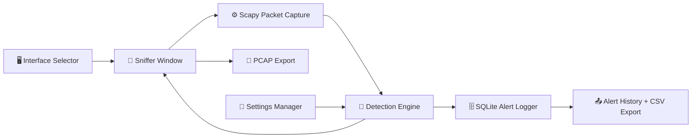

<div align="center">

# 🛡️ NIDS Studio
### Network Intrusion Detection System


*A lightweight, desktop-based Network Intrusion Detection System with a live packet capture engine and a custom dark-themed GUI.*

</div>

---

## 📋 Overview

**NIDS Studio** lets you monitor your network in real time, detect common attack patterns, and inspect individual packets — all from a clean, dark desktop interface.

Pick a network interface → start capturing → watch traffic live → get alerted when something looks suspicious.

> ⚠️ **Requires admin/root privileges** to capture packets. On Windows, [Npcap](https://npcap.com/) must be installed first.

---

## ✨ Features

| Category | What it does |
|---|---|
| 🖥️ **Live Capture** | Capture packets on any network interface in real time |
| 🔍 **Packet Inspector** | View decoded protocol layers and raw hex dump of any packet |
| 🚨 **Threat Detection** | Background engine flags SYN scans, floods, brute-force, and ARP poisoning |
| 💾 **Alert Storage** | All alerts saved to a local SQLite database |
| 📤 **Export** | Export alerts to CSV or save captures as PCAP files |
| ⚙️ **Settings** | Tune detection thresholds at runtime — apply, save, or reset |

### 🔎 Detections

- `SYN Scan` — port scanning via SYN-only packets
- `ICMP Flood` — abnormal volume of ICMP echo requests
- `UDP Flood` — high-rate UDP traffic bursts
- `SSH Brute-Force` — repeated connection attempts on port 22
- `VNC Brute-Force` — repeated connection attempts on port 5900
- `ARP Poisoning` — conflicting ARP mappings on the local network

---

## 🗂️ Project Structure

```
nids/
├── main.py                   # Entry point — run this
│
├── nids_core/                # Core application
│   ├── main.py               # App bootstrap
│   ├── interface_selector.py # Network interface picker
│   ├── sniffer_window.py     # Main GUI window
│   ├── detector.py           # IDS detection engine
│   ├── logger.py             # SQLite alert logger
│   ├── os_utils.py           # OS helpers & privilege checks
│   ├── config.py             # Default constants
│   └── settings.py           # Settings load / save / reset
│
├── scripts/                  # Helper & test scripts
├── docs/                     # Extra documentation
└── data/                     # Runtime files (auto-created)
    ├── nids_alerts.db        # Alert database
    ├── detection_settings.json
    └── *.csv / *.pcap        # Exports
```

---

## 🏗️ System Architecture



---

## 🛠️ Installation

### 1 — Clone the repo

```bash
git clone https://github.com/your-username/nids.git
cd nids
```

### 2 — Create a virtual environment

```bash
# Linux / macOS
python3 -m venv .venv
source .venv/bin/activate

# Windows
python -m venv .venv
.venv\Scripts\activate
```

### 3 — Install dependencies

```bash
pip install scapy customtkinter
```

### 4 — (Windows only) Install Npcap

Download and install from 👉 [https://npcap.com/](https://npcap.com/)

> During install, check **"WinPcap API-compatible mode"** if prompted.

---

## ▶️ Run

### Linux / macOS

```bash
sudo python3 main.py
```

### Windows *(run terminal as Administrator)*

```cmd
python main.py
```

---

## 🚀 Quick Usage

```
1. Launch the app
   └─ The Interface Selector opens

2. Pick your network interface (e.g. eth0, Wi-Fi, en0)
   └─ The NIDS Studio window opens

3. Click [Start] to begin live capture
   └─ Packet cards appear in the traffic rail

4. Click any packet card
   └─ Inspector panel shows decoded details + hex view

5. Use search / protocol filters to focus on specific traffic

6. Alerts appear automatically when a threat pattern is detected
   └─ Open Alert History to browse all stored alerts

7. Export alerts → [Export CSV]
   Save capture  → [Save PCAP]

8. Tune thresholds → open Detection Settings
   └─ Apply (session only) | Save (persistent) | Reset (defaults)
```

---

## 🩹 Troubleshooting

| Problem | Fix |
|---|---|
| *"Permission denied"* or no interfaces shown | Run with `sudo` or as Administrator |
| No packets on Windows | Install [Npcap](https://npcap.com/) in WinPcap-compatible mode |
| BPF filter has no effect | Check filter syntax or leave blank to capture all |
| GUI won't open | Run `pip install scapy customtkinter` in your active environment |
| Detection not triggering | Lower thresholds in the Detection Settings panel |

---

## ⚖️ Disclaimer

> This tool is intended **only** for networks and systems you own or have **explicit written authorisation** to monitor.
>
> Unauthorised packet capture may be illegal under laws such as the CFAA (USA), CMA (UK), and equivalents in other jurisdictions. The authors accept **no liability** for misuse. Use responsibly.

---

## 📄 License

This project is licensed under the [MIT License](LICENSE).

---

<div align="center">
  <sub>Built with 🐍 Python · 📡 Scapy · 🎨 CustomTkinter · 🗄️ SQLite</sub>
</div>