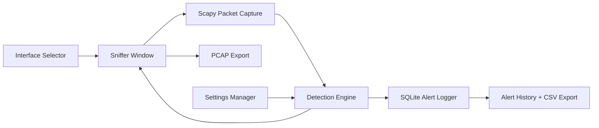

<div align="center">

# NIDS Studio
### Network Intrusion Detection System


</div>

A desktop network intrusion detection tool built in Python. Captures live traffic, runs threat detection in the background, and shows everything in a custom dark GUI.

---

## Overview

NIDS Studio lets you pick a network interface, start a live packet capture, and get alerted when something suspicious shows up — SYN scans, floods, brute-force attempts, ARP poisoning, etc.

**Requires admin/root privileges.** On Windows, [Npcap](https://npcap.com/) must be installed.

---

## Features

- Live packet capture on any network interface
- Dark-themed "NIDS Studio" GUI — traffic rail, packet inspector, search and protocol filters
- Decoded packet view + raw hex dump
- Background IDS engine with these detections:
  - SYN scan
  - ICMP flood
  - UDP flood
  - SSH brute-force (port 22)
  - VNC brute-force (port 5900)
  - ARP poisoning
- Alerts stored in SQLite, exportable to CSV
- Capture sessions exportable to PCAP
- Runtime detection settings — apply for session, save to disk, or reset to defaults

---

## Project Structure

```
nids/
├── main.py                   # run this
│
├── nids_core/
│   ├── main.py               # app bootstrap
│   ├── interface_selector.py # interface picker dialog
│   ├── sniffer_window.py     # main GUI window
│   ├── detector.py           # IDS engine
│   ├── logger.py             # SQLite alert logger
│   ├── os_utils.py           # privilege checks, OS helpers
│   ├── config.py             # defaults and constants
│   └── settings.py           # load / save / reset settings
│
├── scripts/                  # helper and test scripts
├── docs/                     # extra notes
└── data/                     # auto-created at runtime
    ├── nids_alerts.db
    ├── detection_settings.json
    └── *.csv / *.pcap
```

---

## System Architecture



---

## Installation

**1. Clone the repo**

```bash
git clone https://github.com/Manishsarkar1/Network-Intrusion-Detection-System-NIDS-
cd Network-Intrusion-Detection-System-NIDS
```

**2. Create a virtual environment**

```bash
# Linux / macOS
python3 -m venv .venv
source .venv/bin/activate

# Windows
python -m venv .venv
.venv\Scripts\activate
```

**3. Install dependencies**

```bash
pip install scapy customtkinter
```

**4. Windows only — install Npcap**

Download from [npcap.com](https://npcap.com/) and run the installer. Enable **WinPcap API-compatible mode** when prompted.

---

## Run

**Linux / macOS**

```bash
sudo python3 main.py
```

**Windows** (terminal as Administrator)

```cmd
python main.py
```

---

## Quick Usage

1. The Interface Selector opens on launch — pick the interface you want to monitor
2. Click **Start** to begin capture; packets show up in the traffic rail
3. Click any packet to inspect it — decoded layers and hex dump on the right
4. Use the protocol filters or search bar to narrow things down
5. Alerts fire automatically in the background; check **Alert History** to review them
6. Export alerts via **Export CSV**, or save the current capture with **Save PCAP**
7. Adjust detection thresholds in **Detection Settings** — apply, save, or reset

---

## Troubleshooting

| Problem | Fix |
|---|---|
| Permission denied / no interfaces listed | Run with `sudo` or as Administrator |
| No packets captured on Windows | Install Npcap in WinPcap-compatible mode |
| BPF filter has no effect | Check your filter syntax, or leave it blank |
| GUI won't open | Make sure `scapy` and `customtkinter` are installed |
| Detections not triggering | Lower the relevant thresholds in Detection Settings |

---

## Disclaimer

This tool is for use on networks you own or have explicit permission to monitor. Unauthorized packet capture may be illegal under the CFAA, CMA, or equivalent laws in your country. Use it responsibly.

---

## License

[MIT](LICENSE)